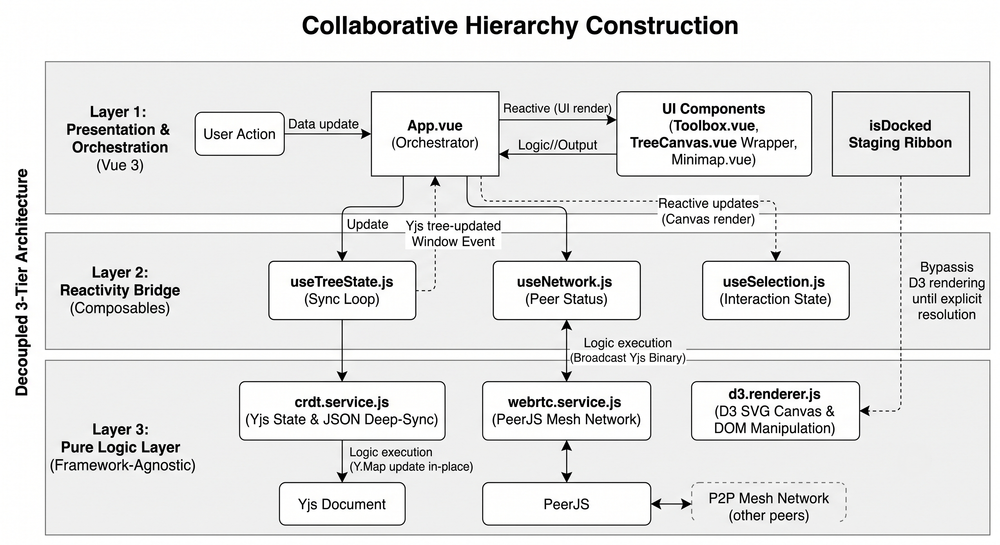

# Distributed Synchronous Collaborative Hierarchy Building with Visualization

## Project Overview

This system is a web-based, interactive environment designed to facilitate the collaborative construction and modification of hierarchical structures. It addresses the challenges of real-time coordination by providing an intuitive space where multiple users can stay aware of changes, maintain data consistency, and resolve structural conflicts through direct manipulation and visualization.

## Architecture & File Structure Breakdown

The application follows a decoupled, three-tier model designed to isolate framework-agnostic logic from the presentation layer (Vue 3). This enforces a unidirectional data flow and ensures the core engine remains stable, preventing infinite rendering loops and state crashes.



### 1. Presentation & Orchestration (Vue 3)
The user interface and central data routing layer.
- **`src/App.vue` (The Orchestrator)**: The central nervous system. It catches user actions from the UI, pushes atomic change proposals into the node conflict queues, and houses the `executeResolution` Conflict Resolution Matrix to finalize structural mutations.
- **`src/components/ui/`**: "Dumb" UI components. Includes the `Toolbox.vue` (a context-aware scanner that finds direct/indirect conflicts and routes accept actions to the correct host node) and the Modals for Rename, Split, and Merge. 
- **`src/components/canvas/TreeCanvas.vue`**: Acts as a lightweight `<svg>` reactivity firewall. It wraps `d3.renderer.js`, intercepts raw browser drop and double-click events to translate them into absolute D3 coordinates, and isolates unplaced concepts in a horizontal staging ribbon.
- **`src/components/canvas/Minimap.vue`**: Renders an abstract, scale-immune geometric replica of the hierarchy. Consumes D3 spatial coordinates to project a synchronous viewport bounding box.

### 2. Reactivity Bridge (Composables)
Acts as the adapter pattern, mapping high-frequency vanilla JavaScript events from the logic layer into safe, reactive Vue state (`ref`, `reactive`) without overloading the UI thread.
- **`src/composables/useTreeState.js`**: Listens to raw `tree-updated` Window events emitted by the CRDT layer. It reconstructs the live JSON state, handles the synchronization loop, and manages the critical boundary between the Staging (global) and Draft (local) environments.
- **`src/composables/useNetwork.js`**: Wraps the WebRTC service to expose connection status (`isHost`, connected peers) to the Vue template.
- **`src/composables/useSelection.js`**: Isolates the logic for single/multi-selection. Uses deep-watchers and flattening to safely re-map selected node references across continuous data sync cycles.

### 3. Pure Logic Layer (Framework-Agnostic)
Standalone ES6 classes and services that handle heavy computational tasks. These files are entirely unaware of Vue's virtual DOM.
- **`src/services/crdt.service.js`**: Manages the Yjs document. Deep-syncs standard JSON objects into binary `Y.Map`/`Y.Array` structures in-place to ensure map identities remain stable. Emits a global `tree-updated` event upon successful network application.
- **`src/services/webrtc.service.js`**: Extends the standard JavaScript `EventTarget`. Handles the PeerJS mesh network, host/client handshakes, and broadcasts the Yjs binary payloads alongside JSON control messages.
- **`src/services/d3.renderer.js`**: The visualization engine performing direct, aggressive DOM manipulation. It dynamically calculates layout projections, explicitly isolates floating nodes and the `isSystemRoot`, handles 60FPS dragging/zooming, and maps pending atomic proposals into visual conflict links and SVG notification badges.

## Core Features

- **Staging vs. Draft Environments**: Users have access to a shared visualization for the global state and individual visualizations to explore or propose changes privately before contributing.
- **Conflict Resolution Matrix**: A specialized logic layer to identify and resolve differences, overlaps, and structural conflicts between local and shared hierarchies.
- **Ghost Projections**: Proposed structural changes (moves or splits) are visualized as "ghost" nodes to help collaborators understand potential modifications.
- **Infinite Canvas**: Support for space-efficient tree visualizations with full zoom and pan capabilities.
- **Real-time Synchronization**: Peer-to-peer data synchronization ensures a consistent state across all connected clients.
- **Floating Nodes & The System Root**: The system supports multiple independent hierarchical trees on a single canvas. An invisible, cloaked top-level node (`isSystemRoot: true`) wraps the underlying JSON structure. Immediate children utilizing explicit `canvasX` and `canvasY` coordinates bypass the standard D3 tree layout algorithm, shifting the node and its entire subtree to absolute free-floating positions.
- **Unplaced Concepts Staging Area**: A horizontal staging ribbon built into the Vue overlay acts as a holding area for unplaced ideas (`isDocked: true`). These suspended nodes are safely filtered out of the D3 structural calculation loop. Users can drag these concepts from the HTML overlay directly onto the SVG canvas to assign them a specific hierarchy position or establish them as new free-floating branches.

## Data Flow Paradigm (Atomic Independent Change Tracking)

The architecture enforces a strict, unidirectional execution sequence for all network edits, isolating state mutation from the visual presentation layer. 

**1. Action Initiation**
A user interacts with a node via the presentation layer (e.g., selecting "Delete" from the `Toolbox.vue` context menu or dragging a node on the `TreeCanvas.vue`).

**2. Atomic Proposal Queuing**
The orchestrator (`App.vue`) intercepts the interaction. Instead of immediately mutating the hierarchical structure, it generates an atomic action object containing a unique identifier and the author's user ID. This payload is pushed into a `conflicts` array on the target node's JSON representation.

*Exception - The `isDocked` Bypass:* Unplaced concepts bypass the standard proposal queue upon instantiation. They receive an `isDocked: true` structural flag and are synced directly via the CRDT. State mutation into a standard node occurs only when a user drags the concept from the HTML overlay and drops it onto the active D3 canvas, which strips the flag and executes the matrix resolution.

**3. CRDT State Synchronization**
The updated JSON state flows through the reactivity bridge (`useTreeState.js`) to the logic layer (`crdt.service.js`). The JSON object is deep-synced into binary `Y.Map` and `Y.Array` structures. `webrtc.service.js` broadcasts the binary state update to all connected peers.

**4. Visual Render and Notification**
`d3.renderer.js` reads the updated `conflicts` array on the incoming canonical state. It translates the pending edits into visual markers (e.g., dashed path lines, orange borders) and appends SVG notification badges displaying the active conflict count.

**5. Resolution Execution**
A user interacts with the conflict prompt and selects an execution path. `App.vue` routes this interaction through the internal `executeResolution` matrix. The system executes the physical structural mutation on the target node, clears the specific atomic payload from the `conflicts` array, and forces a global sync of the new canonical base tree. Atomic deletions apply a soft-delete mechanism, appending historical data to a `deletedChildren` array to preserve the audit trail before splicing the node from the active structure.

## Testing Architecture

The system is verified across two computational boundaries, isolating data transformation logic from distributed network execution. Continuous integration is enforced via GitHub Actions, which provisions a Linux container upon push events to execute all suites. Pipeline execution halts on assertion failure or browser timeout, establishing a regression boundary against structural degradation.

### 1. Local Data Transformation (Vitest)
Executes pure logic files within a Node environment, isolating the CRDT service from Vue reactivity and the browser DOM.
* Injects static JSON structures into the target functions.
* Executes the Yjs encoding sequence.
* Asserts resulting binary arrays match expected outputs.
* Evaluates memory reference preservation during state updates to ensure synchronization logic processes without data corruption prior to transmission.

### 2. Distributed Network Execution (Playwright)
Validates the presentation and network layers by launching two concurrent Chromium processes.
* Programmatically executes the WebRTC initialization in the first process.
* Extracts the generated connection string from the DOM.
* Inputs the connection string into the second process.
* Asserts successful peer-to-peer broker negotiation by scanning the DOM for the client connection badge.

### Regression Boundaries
The current pipeline enforces a strict but narrow regression boundary, constrained to explicitly authored assertions.

**Protected Execution Paths (Failures Detected):**
* Mathematical state convergence and Yjs binary encoding (`crdt.service.js`).
* Preservation of CRDT memory references during deep sync operations.
* Initial WebRTC session negotiation and PeerJS connection lifecycle.

**Unprotected Execution Paths (Failures Undetected):**
* **D3.js DOM Manipulation:** Coordinate miscalculations, SVG path rendering errors, or ghost link visualization failures.
* **Event Routing (Layer 1):** Failures within `Toolbox.vue` context menu routing for rename, split, or merge actions.
* **Atomic Proposal Queue Execution:** Race conditions or matrix resolution failures during simultaneous peer mutations on a single node.
* **Network Partition Recovery:** State reconciliation failures following dropped connections or high-latency packet loss.

## Setup & Installation

### Prerequisites

- Node.js
- npm or pnpm

### Installation

1. **Clone the Repository:**

```bash
git clone https://github.com/ArielMant0/collaborative-hierarchy-construction.git
cd collaborative-hierarchy-construction
```

2. **Install Dependencies:**
```bash
npm install
```

3. **Test Build:**
```bash
npm run build
```

4. **Run Development Server:**
```bash
npm run dev
```

5. **Testing:**
```bash
npm run test:e2e
```
